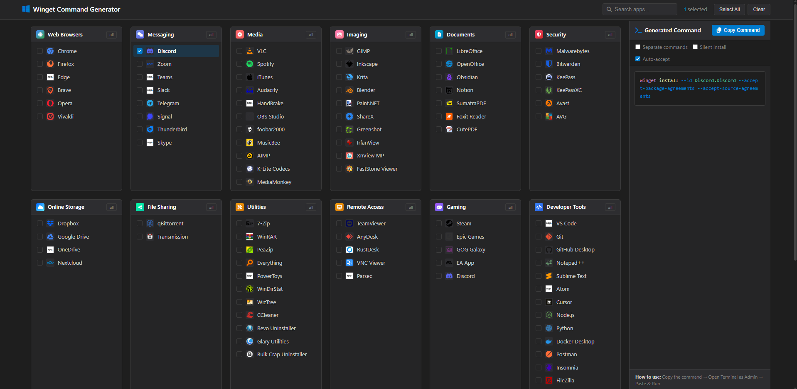

# 🪟 Winget Command Generator (W.I.P.)

<div align="center">


[](https://a2r14n.github.io/Winget-Generator/)
[](https://opensource.org/licenses/MIT)
[](http://makeapullrequest.com)

**A Ninite-style web tool to generate Windows Package Manager (winget) commands for batch installing applications.**

[Live Demo](https://a2r14n.github.io/Winget-Generator/) • [Report Bug](https://github.com/a2r14n/winget-generator/issues) • [Request Feature](https://github.com/a2r14n/winget-generator/issues)

</div>

---

## 📸 Screenshots

<div align="center">

<p><em>Ninite-style interface - All categories visible at once</em></p>
</div>

---

## ✨ Features

<table>
<tr>
<td width="50%">

### 🎯 Core Features
- ✅ **100+ Pre-configured Apps** - Popular software ready to install
- ✅ **Ninite-Style Layout** - All categories visible, no dropdowns
- ✅ **Colored App Icons** - Via Simple Icons & Favicon APIs
- ✅ **Instant Search** - Filter apps by name or package ID
- ✅ **Bulk Selection** - Select all or by category

</td>
<td width="50%">

### 📝 Output Options
- 📄 **Single Command** - All packages in one winget command
- 📋 **Separate Commands** - One command per package
- 🔇 **Silent Install** - Add `--silent` flag
- ✔️ **Auto-Accept** - Auto-accept licenses & agreements

</td>
</tr>
<tr>
<td width="50%">

### ⚙️ Winget Syntax
```powershell
# Single command (multiple packages)
winget install --id App1 App2 App3 --accept-package-agreements

# Separate commands
winget install --id App1 --silent
winget install --id App2 --silent
```

</td>
<td width="50%">

### 🎨 UI/UX
- 🌙 **VS Code Dark Theme** - Easy on the eyes
- 📱 **Fully Responsive** - Works on all devices
- ⚡ **Lightweight** - No frameworks, pure HTML/CSS/JS
- 🎯 **Syntax Highlighting** - Beautiful command output
- 🚫 **No Text Selection** - App-like experience

</td>
</tr>
</table>

---

## 🚀 Quick Start

### Option 1: Use Online (Recommended)
Simply visit: **[a2r14n.github.io/Winget-Generator](https://a2r14n.github.io/Winget-Generator/)**

### Option 2: Run Locally

```bash
# Clone the repository
git clone https://github.com/a2r14n/winget-generator.git

# Navigate to the project
cd winget-generator

# Open in browser (no build required!)
start index.html      # Windows
open index.html       # macOS
xdg-open index.html   # Linux
```

### Option 3: Deploy Your Own

1. Fork this repository
2. Go to **Settings** → **Pages**
3. Select **Deploy from branch** → `main` → `/ (root)`
4. Your site will be live at `https://yourusername.github.io/winget-generator/`

---

## 📁 Project Structure

```
winget-generator/
├── index.html          # Main HTML file
├── css/
│   └── styles.css      # All styles (VS Code theme, Ninite layout)
├── js/
│   ├── icons.js        # Icon sources (Simple Icons, Favicon APIs)
│   ├── data.js         # App database (100+ apps)
│   └── app.js          # Main application logic
├── screenshots/        # Screenshots for README
├── README.md           # This file
└── LICENSE             # MIT License
```

---

## 📦 App Categories

| Category | Apps | Examples |
|----------|------|----------|
| 🌐 **Web Browsers** | 6 | Chrome, Firefox, Edge, Brave, Opera, Vivaldi |
| 💬 **Messaging** | 8 | Discord, Zoom, Teams, Slack, Telegram, Signal |
| 🎵 **Media** | 11 | VLC, Spotify, Audacity, OBS Studio, HandBrake |
| 🎨 **Imaging** | 10 | GIMP, Inkscape, Krita, Blender, ShareX |
| 📄 **Documents** | 7 | LibreOffice, Obsidian, Notion, SumatraPDF |
| 🛡️ **Security** | 6 | Malwarebytes, Bitwarden, KeePass, KeePassXC |
| ☁️ **Online Storage** | 4 | Dropbox, Google Drive, OneDrive, Nextcloud |
| 🔧 **Utilities** | 11 | 7-Zip, PowerToys, Everything, CCleaner |
| 🖥️ **Remote Access** | 5 | TeamViewer, AnyDesk, RustDesk, Parsec |
| 🎮 **Gaming** | 5 | Steam, Epic Games, GOG Galaxy, EA App |
| 💻 **Developer Tools** | 17 | VS Code, Git, Node.js, Python, Docker |
| 🔷 **.NET Runtimes** | 5 | .NET 8, .NET 7, .NET 6, ASP.NET Core |
| ☕ **Java** | 7 | Temurin JDK/JRE 21, 17, 11, Amazon Corretto |
| ⚙️ **VC++ Runtimes** | 8 | VC++ 2015-2022, 2013, 2012, 2010 (x64/x86) |

**Total: 100+ Applications**

---

## 🛠️ How It Works

1. **Select Apps** - Click on apps you want to install
2. **Configure Options** - Choose silent install, auto-accept, etc.
3. **Copy Command** - Click "Copy Command" button
4. **Run in Terminal** - Open PowerShell/Terminal as Admin and paste

### Generated Command Example:
```powershell
winget install --id Google.Chrome Mozilla.Firefox Microsoft.VisualStudioCode --accept-package-agreements --accept-source-agreements
```

---

## ➕ Adding New Apps

Edit `js/data.js` to add new applications:

```javascript
{
    name: "App Name",
    id: "Publisher.AppName",  // Winget package ID
    iconUrl: IconSources.simpleIcon('iconname')  // or .favicon('domain.com')
}
```

### Finding Winget Package IDs:
```powershell
winget search "app name"
```

### Icon Sources:
```javascript
IconSources.simpleIcon('spotify')     // Brand logos (colored)
IconSources.favicon('example.com')    // Website favicons
```

---

## 🎨 Customization

### Changing Theme Colors
Edit CSS variables in `css/styles.css`:

```css
:root {
    --bg-primary: #1e1e1e;
    --bg-secondary: #252526;
    --accent-blue: #007acc;
    --accent-green: #4ec9b0;
    /* ... */
}
```

### Adding New Categories
Edit `js/data.js`:

```javascript
"New Category": {
    icon: "fa-icon-name",       // Font Awesome icon
    colorClass: "cat-custom",   // CSS class for color
    apps: [
        { name: "App", id: "Package.ID", iconUrl: IconSources.simpleIcon('icon') }
    ]
}
```

Add color in `css/styles.css`:
```css
.cat-custom { background: linear-gradient(135deg, #color1, #color2); }
```

---

## ❓ FAQ

<details>
<summary><strong>What is Winget?</strong></summary>

Windows Package Manager (winget) is Microsoft's official command-line tool for installing applications on Windows 10/11.

```powershell
winget install Google.Chrome           # Install single app
winget install App1 App2 App3          # Install multiple apps
winget upgrade --all                   # Update all apps
```
</details>

<details>
<summary><strong>How do I install Winget?</strong></summary>

Winget comes pre-installed on Windows 11 and recent Windows 10 versions. If missing:
1. Open **Microsoft Store**
2. Search for **"App Installer"**
3. Install/Update it

Or download from [GitHub](https://github.com/microsoft/winget-cli/releases).
</details>

<details>
<summary><strong>Can I install multiple apps at once?</strong></summary>

Yes! Winget supports installing multiple packages in one command:
```powershell
winget install --id Package1 Package2 Package3
```
This is the default output format of this tool.
</details>

<details>
<summary><strong>Why are some icons missing?</strong></summary>

Icons are loaded from external APIs (Simple Icons, Google Favicon). If an icon fails:
- The app may not have a Simple Icons entry
- Fallback to favicon API is attempted
- A 📦 emoji is shown as last resort
</details>

---

## 🤝 Contributing

Contributions are welcome!

1. **Fork** the repository
2. **Create** feature branch (`git checkout -b feature/NewFeature`)
3. **Commit** changes (`git commit -m 'Add NewFeature'`)
4. **Push** to branch (`git push origin feature/NewFeature`)
5. **Open** Pull Request

### Ways to Contribute:
- 🐛 Report bugs
- 💡 Suggest features
- 📦 Add new apps
- 🎨 Improve UI/UX
- 📖 Improve documentation

---

## 📋 Roadmap

- [x] Ninite-style flat layout
- [x] Single command with multiple packages
- [x] Colored app icons
- [x] Search functionality
- [x] Responsive design
- [x] Syntax highlighting
---

## 📜 License

Distributed under the **MIT License**. See `LICENSE` for more information.

---

## 🙏 Acknowledgments

- [Simple Icons](https://simpleicons.org/) - Brand icons
- [Google Favicon API](https://www.google.com/s2/favicons) - Website favicons
- [Font Awesome](https://fontawesome.com/) - UI icons
- [Microsoft Winget](https://github.com/microsoft/winget-cli) - Windows Package Manager
- [Ninite](https://ninite.com/) - UI inspiration

---

<div align="center">

### ⭐ Star this repo if you find it useful!

Made with ❤️ for the Windows community

[](https://github.com/a2r14n/winget-generator/stargazers)
[](https://github.com/a2r14n/winget-generator/network/members)

</div>
